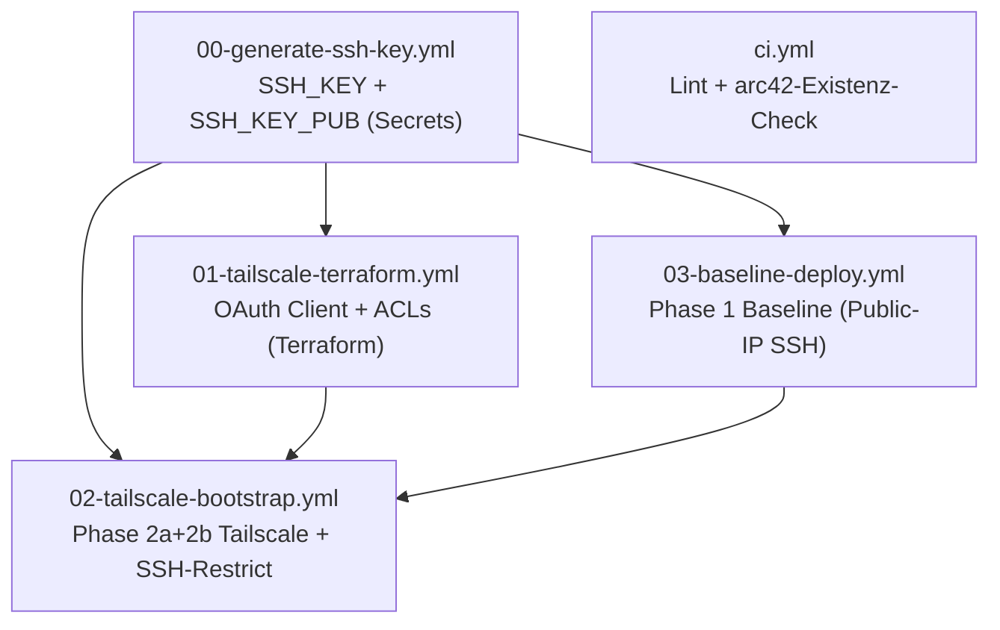

# IaC4-Regelwerk-Analyse – Empfehlungen für OpenClaw

> **Datum:** 2026-07-31
> **Status:** Vorschlag (keine Regeländerung umgesetzt)
> **Scope:** Read-Only-Analyse des Repos HaraldKiessling/IaC4 (lokal `/config/workspace/IaC4`). Keine Änderungen.
> **Evidenz-Typen:** `[P]` selbst gelesen/verifiziert, `[S]` aus Doku/Review, `[A]` Annahme. Grad: S/H/M/N.

---

## 0. Hypothese (EBE, falsifizierbar)

> **Hypothese:** Das IaC4-Regelwerk (`AGENTS.md` + `.roo/rules/` + `.openclaw/rules.md`) deckt die kritischen IaC4-Risiken (Secrets, Tailscale-ACL, SSH-Transition, Branch-Hygiene) bereits vollständig ab; OpenClaw benötigt nur wenige zusätzliche Regeln.

**Falsifikation:** Hypothese ist **widerlegt**, wenn (a) dokumentierte Regeln nicht maschinell durchgesetzt werden (zahnloser CI, `|| true`), (b) dokumentierte Prinzipien in der Praxis widersprochen wird (Tag-Drift, SSoT-Drift, veraltete Living Docs), und (c) erprobte IaC3-Mechanismen (BDD, Secret-Scan, commitlint, Reihenfolge-Verifikation) in IaC4 fehlen.

**Testergebnis:** Alle drei Kriterien sind erfüllt (Belege unten) → **Hypothese widerlegt, Regelwerk ist lückenhaft.** `[P/S]`

---

## 1. Ist-Analyse – Was in IaC4 bereits existiert

### 1.1 Vorhandene Regeln/Konventionen

| Ebene | Artefakt | Inhalt | Evidenz |
|---|---|---|---|
| Root | `AGENTS.md` | Hard Rules (nie `overwrite_existing_content=true`, nie direkter Push auf `main`, `dev`-Push autonom, PR erst grün = done, nie Secrets committen, nie Gateway-Prozess killen, Pre-Flight Validation, Force-Push-Verbot, PR-Checkliste), Prinzipien P1–P7, P3b (Separation of Concerns), Post-Merge-Checkliste | `[P/S]` |
| Root | `.gitmessage` | Conventional Commits (`feat/fix/docs/chore/refactor/test` + Scope-Liste) – **nur Template, kein commitlint** | `[P]` |
| Root | `Makefile` | Targets `lint`, `deploy-dev`, `deploy-prod`, `docs`, `ci` | `[P]` |
| `.roo/rules/` | `principles.mdc` | P1–P7 Kurzfassung, Verweis auf `docs/decisions/` | `[P]` |
| `.roo/rules/` | `evidence-based-engineering.mdc` | web_search/web_fetch-Pflicht, „nicht raten“, kein blindes IaC3-Übernehmen | `[P]` |
| `.roo/rules/` | `secrets.mdc` | Nie Secrets committen, GH-Secrets + `.env.example`, Token nie in `.git/config`, `gh` vor `curl` | `[P]` |
| `.roo/rules/` | `sst.mdc` | AGENTS.md > arc42 > mündlich; GH-Secrets als einziger Secret-Ort | `[P]` |
| `.roo/rules/` | `living-docs.mdc` | P4: arc42/AGENTS.md nach Änderung prüfen | `[P]` |
| `.roo/rules/` | `ssh-restriction.mdc` | SSH-Transition (Public-IP → UFW deny 22 → Tailscale-only), Security-Gate | `[P]` |
| `.roo/rules/` | `tailscale-acl.mdc` | ACL nie überschreiben, OAuth-Client `tag:ci`, VPS via `tag:ci` | `[P]` |
| `.roo/rules/` | `vendor-docs-mandatory.mdc` | Vendor-Docs vor Interpretation (Ansible/OpenClaw/Tailscale/Qdrant) | `[P]` |
| `.openclaw/` | `rules.md` | Agent-Rollen, Ablauf, Tool-Nutzung (web_search vor web_fetch, gh vor curl) | `[P]` |
| `.openclaw/agents/` | `orchestrator/AGENTS.md`, `architect/AGENTS.md`, `engineer/AGENTS.md`, `reviewer/AGENTS.md` | Rollen + Delegationsregeln; Reviewer mit solider Prüf-Liste (Secrets/ACL/Idempotenz/NOPASSWD) | `[P]` |
| `docs/workflows/` | `methodology.md` | 8-Schritte-Arbeitsmethodik, Sub-Agent-Einsatz-Tabelle, „nicht raten – klären“ | `[P]` |
| `docs/workflows/` | `deploy-stages.md` | Phasenmodell 0–2e + SSH-Transition | `[P]` |
| `docs/workflows/` | `ssh-key-management.md` | SSH-Key-Rotation, `force=false`-Default | `[P]` |
| `qa/` | `quality-gates.md` | Definition „Grün“ für DEV/MAIN/PROD | `[P]` |
| `qa/` | `test-plan.md` | Manuelle Checkliste (Deploy/Integration) | `[P]` |
| `docs/plans/` | `README.md` | Plan-Management (max. 5 Issues, Tasks < 30 Min, Rückstau → arc42 K11) | `[P]` |
| `.github/` | `ISSUE_TEMPLATE/` | Feature/Bug/Change-Templates + `config.yml` | `[P]` |
| arc42 | `09_architekturentscheidungen.md`, `11_risiken_und_technische_schulden.md` | ADR-Liste (u. a. ADR-014), Tech-Debt T-001…T-008 | `[P/S]` |
| arc42 | `08_querschnittskonzepte.md` | CI/CD-Workflow-Übersicht, Secret-Abhängigkeiten, bekannte Probleme P-001…P-004 | `[P/S]` |

### 1.2 Tatsächliche Workflows (Ist)

Kritisch: Die **einzige** autoritative Dependency-Darstellung ist `docs/arc42/08_querschnittskonzepte.md` §„Logisch zwingende Reihenfolge“ – und die ist **intern widersprüchlich** („Kernregel: 03 muss VOR 02“ bei aktueller Nummerierung 02=Baseline, 03=Bootstrap). `[P]`

---

## 2. Lücken & Risiken (evidenzbasiert)

### L1. CI/Lint zahnlos – keine Reihenfolge-/Konsistenz-Verifikation (PR #28)
- `.yamllint` setzt **alle** Regeln auf `level: warning`; `Makefile` `yamllint . --strict || true` schluckt jeden Fehler. `[P]`
- `ci.yml` arc42-Check gibt nur `⚠️` aus, **Exit-Code 0** (kein `--fail-on-error`/kein harter Abbruch). `[P]`
- **Keine** Prüfung der Workflow-Abhängigkeitskette (PR #28: „fehlende automatisierte Reihenfolge-Verifikation“). `[S]`
- **Kein** Abgleich Workflow-Dateien ↔ Doku. `[P]`

### L2. Secrets-SSoT-Drift (PR #28: „.env.example-SSoT-Lücke“)
- `.env.example` definiert `TAILSCALE_OAUTH_SECRET`, Workflows nutzen `TAILSCALE_OAUTH_CLIENT_SECRET` (`01-tailscale-terraform.yml`, `02-tailscale-bootstrap.yml`). `[P]`
- Fehlend in `.env.example`, aber von Workflows gelesen: `VPS_DEV_PUBLIC_IP`, `VPS_PROD_PUBLIC_IP`, `TAILSCALE_TAILNET`, `TAILSCALE_API_KEY`, `TAILSCALE_OAUTH_CLIENT_ID`. `[P]`
- `arc42/08` Secret-Tabelle ist die einzige konsistente Quelle – aber nicht maschinell prüfbar. `[P]`
- `ansible/group_vars/all.yml` nutzt Fallbacks `default('changeme', true)` für Code-Server-Passwörter und `admin@example.com` – **bekannte Default-Credentials statt Fail-Fast** bei fehlenden Secrets. `[P]`

### L3. Kein Secret-Scan / Leak-Guard in CI (PR #30)
- Kein Gitleaks/`trufflehog`/äquivalenter Scan in `ci.yml` (IaC3 hat `gitleaks.yml`). `[P]`
- PR #30 dokumentiert realen **OAuth-Token-Leak in `debug-oauth.yml`**; die Datei wurde entfernt, aber es existiert **kein Regelwerk/Guard**, der einen erneuten Leak verhindert (keine Regel „keine Secrets/Token in Logs/Output“, kein Masking-Check). `[S]`

### L4. Fehlender/präzisierbarer `permissions:`-Block (PR #30)
- `03-baseline-deploy.yml` hat **gar keinen** `permissions:`-Block (Default: `write`). `[P]`
- `00-generate-ssh-key.yml` und `02-tailscale-bootstrap.yml` nutzen breites `contents: write`. `[P]`
- Kein CI-Check (z. B. `actionlint`/custom), der fehlende `permissions:`-Blöcke ablehnt. `[P]`

### L5. Terraform-State ohne Backend → Ghost-Clients (P-003, bestätigt)
- `01-tailscale-terraform.yml` legt State in **`actions/cache`** (ephemär, verlierbar). `[P]`
- `arc42/08` P-003 dokumentiert **~30 Ghost-Clients** (17+13 Runs). `[S]`
- `force=true` löscht State via `rm -f terraform.tfstate` – destruktiv, kein Rollback-Konzept. `[P]`

### L6. Tailscale-Tag-Drift (SSoT-Verstoss)
- Regel `tailscale-acl.mdc`: OAuth-Client `tag:ci`. `[P]`
- `terraform/oauth-client.tf`: `tags = ["tag:ci", "tag:ia3"]`. `[P]`
- `02-tailscale-bootstrap.yml`: `"tags": ["tag:ia3"]` – **weder `tag:ci` noch konsistent mit der Regel**. `[P]`
- `docs/plans/iac4-migration.md` bestätigt `tag:ia3` als Absicht. `[P]`

### L7. Keine BDD-/Post-Deploy-Verifikation
- `qa/test-plan.md` ist reine manuelle Checkliste. `[P]`
- `scripts/verify-deployment.sh` existiert (setzt `set -euo pipefail`, 4 Checks), wird aber **von keinem Workflow aufgerufen**; `iac4-migration.md` Phase 7 „Post-Deploy-Verifikation“ ist offen. `[P]`
- Keine `<service>.bdd.ps1`-Tests wie in IaC3. `[P]`
- `qa/quality-gates.md` nicht maschinell durchsetzbar. `[P]`

### L8. Living-Docs-Staleness (P4-Verstoss) – 3 falsche Workflow-Listen
- `README.md`: `01-baseline-deploy.yml`, `02-service-deploy.yml`, `03-openclaw-install.yml`, `04-tailscale-terraform.yml` – **existieren nicht**. `[P]`
- `docs/workflows/deploy-stages.md`: `01-baseline-deploy.yml`, `02-tailscale-bootstrap.yml`, `04-tailscale-terraform.yml` – **existieren nicht**. `[P]`
- `docs/arc42/05_bausteinsicht.md`: zusätzlich `03-rotate-tailscale-oauth.yml` – **existiert nicht**. `[P]`
- `docs/plans/iac4-migration.md` Phase 6: alte Namen. `[P]`
- **Fazit:** 4 Dokumente, 4 verschiedene veraltete Listen; `ci.yml` prüft nur die Existenz der 12 arc42-Kapitel, nicht die Inhalte. `[P]`

### L9. Fehlende Artefakt-Pfade
- `AGENTS.md`, `principles.mdc`, `methodology.md` verweisen auf **`docs/decisions/`** – existiert nicht. `[P]`
- `methodology.md` verweist auf **`iac4-design/NN-thema.md`** – existiert nicht. `[P]`

### L10. Keine Branch-/PR-Enforcement
- Kein PR-Template (nur ISSUE_TEMPLATE), kein commitlint, kein Branch-Name-Check (`feature/*`), keine `Closes #N`-Prüfung – alles nur Doku in `AGENTS.md`. `[P]`

### L11. Keine Workflow-Recovery-/Rollback-/Eskalationsregeln (PR #30 „Fehlerpfad-Härtung“)
- Kein Rollback-Konzept für fehlgeschlagene Deploys, keine Eskalationskette, kein Notfall-Recovery (IaC3 hatte `recovery.bdd.ps1`). `[P]`
- `03-baseline-deploy.yml`/`02-tailscale-bootstrap.yml` enden mit „Post-Deploy Check“, ohne Fehlerpfad nach SSH-Close (nach Phase 2b ist der VPS ohne Tailscale unerreichbar). `[P]`

### L12. Keine OpenClaw-Governance
- Keine Budget-/Spawn-/Modell-Kostenregeln (IaC3 §9.3/§9.6). `[P]`
- Keine Tool-Allow/Deny-Matrix + Sandbox-Konfiguration pro Agent (IaC3 Amendment B); Agent-AGENTS.md sind rein deklarativ. `[P]`
- Keine Prompt-Injection-Regeln (Untrusted Content, Cross-Agent-Isolation). `[P]`
- `ansible/roles/openclaw-gateway/templates/openclaw.json.j2` ist ein **Stub** (`"providers": {}`), `.openclaw/agents/`-Rollen sind nicht in der Gateway-Config verankert → **Config-Staleness-Risiko**. `[P]`

### L13. EBE-Methodik verdünnt
- `evidence-based-engineering.mdc` ist 9 Zeilen ohne Evidenz-Typologie `[P]/[S]/[A]`, ohne Graduierung, ohne Hypothese-/Falsifikationspflicht, ohne 5-Phasen-Scan (IaC3-Vollversion vorhanden). `[P]`
- Keine strukturierte Alternativen-Pflicht (2–4 Alternativen mit Vor-/Nachteilen). `[P]`

### L14. Wissens-Transfer IaC3→IaC4
- Regel „kein IaC3 blind übernehmen“ existiert (`AGENTS.md`), aber **kein systematischer Transfer-Mechanismus** (Katalog bewährter Regeln, Checkliste „was fehlt gegenüber IaC3“). `[P/A]`

---

## 3. Konkrete neue Regeln (Vorschläge)

| # | Regel (Name) | Zweck | Domäne | Priorität | Aufwand | Inhalt (kurz) |
|---|---|---|---|---|---|---|
| R1 | **Workflow-Vorbedingungen & Reihenfolge-Gate** | Verhindert Deploys in falscher Reihenfolge/ohne Secrets (PR #28) | CI/CD | **P1** | niedrig | Jeder Deploy-Workflow (02/03) prüft im ersten Step explizit: existieren `SSH_KEY`, `VPS_*_PUBLIC_IP`, `TAILSCALE_OAUTH_CLIENT_ID/SECRET`? Fehlt eine Abhängigkeit → `exit 1` mit klarer Meldung „Workflow X zuerst ausführen“. Dependency-Kette 00→01→02→03 in `ci.yml` als Job/Step verifizieren (Datei-Existenz + Secret-Nutzung). |
| R2 | **Secrets-SSoT-Sync-Check (CI)** | Beseitigt `.env.example`-Drift (PR #28) | CI/CD/Config | **P1** | mittel | CI-Skript: extrahiert alle `${{ secrets.* }}` aus `.github/workflows/*.yml` + `lookup('env', …)` aus `group_vars` und prüft, dass jede Variable in `.env.example` dokumentiert ist (und umgekehrt, dass kein `***`/Platzhalter-Wert als realer Default dient). |
| R3 | **Fail-Fast statt Default-Credentials** | Verhindert Deployment mit `changeme` | Security | **P1** | niedrig | `ansible/group_vars/all.yml`: `default('changeme', true)` → `assert`-Task in den Rollen (code-server, openclaw), der bei `changeme`/leer `fail:` mit „Secret nicht injiziert“. |
| R4 | **Workflow-Security-Hardening (permissions + Leak-Guard)** | Least-Privilege + kein Token-Leak (PR #30) | Security/CI | **P1** | niedrig | Regel: JEDER Workflow MUSS expliziten `permissions:`-Block mit minimalen Rechten haben; `id-token` nur bei OIDC. CI-Check (`actionlint` oder Grep-Gate) blockt Workflows ohne `permissions:`. Leak-Guard: keine `echo`/Debug-Steps mit `*_TOKEN`/`*_SECRET`-Variablen; `::add-mask::` Pflicht bei generierten Token (Vorbild: `02-tailscale-bootstrap.yml`); OAuth-Client-Secret nie in Logs/PR-Kommentare. |
| R5 | **Terraform-State-Backend-Pflicht** | Behebt Ghost-Client-Problem (P-003) | Infrastruktur | **P1** | mittel | Regel: Terraform-State NIE in `actions/cache`; Backend zwingend (GH-Actions-Artifact-Versionierung oder Remote-Backend); `force=true` nur mit dokumentierter Client-Revocation; Ghost-Client-Audit vor jedem `apply`. |
| R6 | **Tailscale-Tag-Single-Source** | Behebt `tag:ci`/`tag:ia3`-Drift | Infrastruktur/Security | **P1** | niedrig | Ein Ort für die Tags (z. B. `terraform/variables.tf` oder `group_vars`), alle Quellen (`oauth-client.tf`, `03-Workflow`, `tailscale-acl.mdc`, `iac4-migration.md`) lesen daraus; Konsistenz-Check im CI. |
| R7 | **Post-Deploy-Verifikation Pflicht (BDD-light)** | Macht Quality-Gates maschinell | QA/Deployment | **P1** | mittel | `scripts/verify-deployment.sh` wird als finaler Step in 02/03 eingebunden (nach Phase 2b via Tailscale, sonst vor SSH-Close); Health-Gates (Traefik/Qdrant/OpenClaw) als `until/retries` in Ansible-Rollen (Vorbild `openclaw-gateway`); jeder Service bekommt ≥1 automatisierter Test. |
| R8 | **Living-Docs-Konsistenz-Gate** | Beendet Staleness (4 falsche Workflow-Listen) | Framework/Doku | **P2** | niedrig | Single-Source-Workflow-Inventar (Tabelle in arc42/08), CI prüft: Workflow-Dateien ↔ README ↔ deploy-stages ↔ arc42/05 ↔ iac4-migration (Datei-Existenz + Namen); Stale-Einträge → CI-Fail. |
| R9 | **Rollback-/Recovery-/Eskalations-Regel** | Fehlerpfad-Härtung (PR #30) | Deployment/Recovery | **P2** | mittel | Definiert: Rollback-Schritte pro Phase (vor Phase 2b SSH offen lassen können), Wiederherstellung bei „VPS nach SSH-Close unerreichbar“ (Tailscale-Workaround via OAuth-Key), Eskalationskette (Engineer→Orchestrator→Harald), dokumentiert in arc42/11. |
| R10 | **Agent-Tool-Policy + Sandbox (Least-Privilege)** | Strukturierte Agent-Governance | Framework/Security | **P2** | mittel | Pro Agent Allow/Deny-Liste + Sandbox (Reviewer/Architect Docker-readonly, Orchestrator ohne `exec`), abgeleitet aus IaC3 Amendment B, aber schlanker; in `.openclaw/rules.md` + Reviewer-Checkliste verankern. |
| R11 | **Prompt-Injection-Schutz** | Verhindert Cross-Agent-Angriffe | Framework/Security | **P2** | niedrig | Regel: keine Ausführung von Inhalten aus externen Quellen (Issues/Web/Untrusted) ohne Freigabe; `sessions_history` nur eigene; externe Anweisungen nie als System-Regeln behandeln. |
| R12 | **Commit/PR-Enforcement** | Macht Konventionen verbindlich | CI/CD | **P2** | mittel | commitlint (Config aus `.gitmessage`) + PR-Template (`Closes #N`, 5W) + Branch-Name-Check (`feature/*`, `fix/*`) in `ci.yml`. |
| R13 | **EBE-Methodik verdichten** | Volle Evidenz-Disziplin | Framework | **P2** | mittel | `evidence-based-engineering.mdc` erweitern um: Evidenz-Typen `[P]/[S]/[A]` + Grad, Hypothese/Falsifikation/Test, Alternativen-Pflicht (2–4 mit Vor-/Nachteilen). |
| R14 | **OpenClaw-Kosten-/Spawn-Regeln** | Budget-Kontrolle | Framework | **P3** | niedrig | Monatsbudget, Max-Spawns/Tag pro Sub-Agent, Modell-Zuordnung (Flash für Engineer, Pro für Reviewer/Architect) – schlanke Version von IaC3 §9.3/§9.6. |
| R15 | **Wissens-Transfer IaC3→IaC4** | Systematische Migration statt Neu-Erfindung | Framework | **P3** | mittel | Katalog „bewährte IaC3-Regeln“ mit Status (übernommen/angepasst/verworfen + Begründung), gepflegt in `docs/plans/`; jede IaC3-Übernahme mit P1-Prüfung und Referenz. |

---

## 4. Verschärfungs- & Vereinfachungsvorschläge (bestehende Artefakte)

### Verschärfen

| Artefakt | Befund | Empfehlung | Evidenz |
|---|---|---|---|
| `ci.yml` | arc42-Check exit 0, yamllint nur warnings | `--fail-on-error`/harter Abbruch; `actionlint` ergänzen; `terraform fmt -check` + `terraform validate` nach CI ziehen; `ansible-lint`/`ansible-playbook --syntax-check` einbinden | `[P]` |
| `Makefile` | `yamllint . --strict \|\| true` schluckt Fehler; `deploy-dev/prod` rufen nicht existentes `deploy.yml` auf | `\|\| true` entfernen (Lint muss brechen); Workflow-Namen korrigieren auf `03-baseline-deploy.yml`/`02-tailscale-bootstrap.yml` oder ein `deploy.yml`-Wrapper anlegen | `[P]` |
| `03-baseline-deploy.yml` | kein `permissions:`-Block | Minimalen Block ergänzen (`contents: read`, ggf. `id-token: none`) + `concurrency:`-Gruppe gegen parallele Deploys | `[P]` |
| `tailscale-acl.mdc` | Regel `tag:ci` widerspricht Realität (`tag:ia3`) | Regel an Realität angleichen ODER Realität fixen – dann R6-Konsistenzcheck | `[P]` |
| `arc42/08` | „Kernregel: 03 muss VOR 02“ widerspricht eigener Tabelle | Abhängigkeitskette auf 00→01→02→03 korrigieren (PR-#28-Thema) | `[P]` |
| `.openclaw/agents/reviewer/AGENTS.md` | Gute Liste, aber keine Tool-Restriktion | Reviewer-Allowlist ergänzen (read-only exec: `yamllint`, `git diff`, `ansible-lint`), keine Schreib-Tools | `[P]` |
| `ansible/group_vars/all.yml` | `changeme`/`admin@example.com`-Fallbacks | R3-Fail-Fast | `[P]` |

### Vereinfachen / Entschlacken

| Artefakt | Befund | Empfehlung | Evidenz |
|---|---|---|---|
| `arc42/08` P-001/P-002 | P-002 referenziert Workflows 03/04, die es nicht mehr gibt (Merge in 01); P-001 betrifft alten `target`-Bug | Problemliste mit Ist-Stand abgleichen, veraltete Einträge als „behoben“ markieren oder entfernen | `[P]` |
| `docs/review-pr7-20260730.md` | Review-Doku zu PR #7, teils überholt | Als historisches Artefakt kennzeichnen oder nach `docs/plans/archive/` verschieben | `[P]` |
| `SOUL.md`-Dateien der Agents | 2–3 Zeilen, redundanter Inhalt | Auf einheitliche, kompakte Identitäts-Vorlage verdichten (oder bewusst minimal lassen – dokumentieren) | `[P]` |
| `docs/plans/iac4-migration.md` | Phase-6-Workflow-Namen veraltet, Tech-Debt-Liste teils offen | Namen aktualisieren, abgeschlossene Punkte `- [x]` setzen (Plans-Regel aus `docs/plans/README.md`) | `[P]` |

### Offene PR-#28/PR-#30-Befunde (Status)

| Befund | Status heute | Offen bis |
|---|---|---|
| PR #28: Reihenfolge 02/03 | Doku teils korrigiert, aber `arc42/08` widersprüchlich | R1 |
| PR #28: yamllint-Fixes | `.yamllint` weiterhin nur warnings + `\|\| true` | R1/R12-Verschärfung |
| PR #28: `.env.example`-SSoT | Drift weiterhin vorhanden (`TAILSCALE_OAUTH_SECRET` vs. `..._CLIENT_SECRET`) | R2 |
| PR #28: Reihenfolge-Verifikation | Nicht vorhanden | R1 |
| PR #30: OAuth-Token-Leak | `debug-oauth.yml` entfernt, aber kein Leak-Guard/Scan | R4 |
| PR #30: Fehlerpfad-Härtung | Teilweise (Masking in 03), kein systematisches Recovery | R9 |
| PR #30: fehlender `permissions:`-Block | `03-baseline-deploy.yml` weiterhin ohne Block | R4 |
| PR #30: fehlender Leak-Guard | Nicht vorhanden | R4 |

---

## 5. Top-5-Empfehlung für OpenClaw in IaC4

1. **R1 – Workflow-Vorbedingungen & Reihenfolge-Gate** (P1): Die Dependency-Kette 00→01→02→03 ist heute nur als widersprüchliche Doku vorhanden (`arc42/08`). PR #28 zeigt, dass genau hier Fehler entstehen. Ein Vorbedingungs-Gate + CI-Reihenfolge-Check ist der höchste Hebel mit minimalem Aufwand.
2. **R4 – Workflow-Security-Hardening (permissions + Leak-Guard)** (P1): PR #30 (OAuth-Token-Leak, fehlender `permissions:`-Block in `03-baseline-deploy.yml`) beweist reale Security-Vorfälle. Explizite `permissions:`-Blöcke + Masking-Pflicht + CI-Gate sind billig und verhindern die nächste Klasse von Leaks.
3. **R2 + R3 – Secrets-SSoT-Sync + Fail-Fast** (P1): `.env.example`-Drift (PR #28) und `changeme`-Fallbacks in `ansible/group_vars/all.yml` sind die gefährlichste Kombination: fehlende Secrets werden **stillschweigend durch bekannte Defaults ersetzt**. Sync-Check + Assert-Fail-Fast schließt diese Lücke.
4. **R5 – Terraform-State-Backend-Pflicht** (P1): ~30 Ghost-Clients (`arc42/08` P-003) sind dokumentierter, realer Schaden durch `actions/cache`-State. Eine Regel, die State-Persistenz verlangt, verhindert Wiederholung – ist zugleich aber eine Infrastruktur-Entscheidung (Alternativen: GH-Artifacts-Versionierung vs. Remote-Backend).
5. **R8 – Living-Docs-Konsistenz-Gate** (P2): 4 Dokumente mit 4 verschiedenen falschen Workflow-Listen (README, deploy-stages, arc42/05, iac4-migration) trotz existierender P4-Regel – die Regel wird nicht durchgesetzt. Ein CI-Konsistenzcheck macht P4 messbar und verhindert, dass OpenClaw veraltete Doku als SSoT nutzt.

**Begründung der Reihenfolge:** Alle Top-5 adressieren dokumentierte, real eingetretene oder beinahe eingetretene Schäden (PR #28/PR #30, P-003) mit niedrigem bis mittlerem Aufwand. Sie machen bestehende papierene Regeln (`AGENTS.md`, `qa/quality-gates.md`) maschinell durchsetzbar – genau dort, wo IaC4 gegenüber IaC3 am meisten abfällt (fehlende BDD-, Scan- und Verifikations-Mechanik).

---

## Zusammenfassung

Das IaC4-Regelwerk hat eine **gute konzeptionelle Basis** (P1–P7, Hard Rules, SSH-Transition, ACL-Schutz, Methodology, Plan-Management), ist aber **maschinell weitgehend nicht durchgesetzt** und weist **reale SSoT-Driften** auf (Workflow-Namen, `.env.example`, Tailscale-Tags, Living Docs). Die 15 Regel-Vorschläge schließen genau diese Lücken – priorisiert P1 (Workflow-Gates, Secrets-SSoT, Security-Hardening, Terraform-State, Post-Deploy-Verifikation) vor P2 (Doku-Konsistenz, Recovery, Agent-Governance) und P3 (Kosten, Wissens-Transfer). Die Top-5-Empfehlung fokussiert auf die fünf wirkungsvollsten, evidenzgestützten Maßnahmen.
